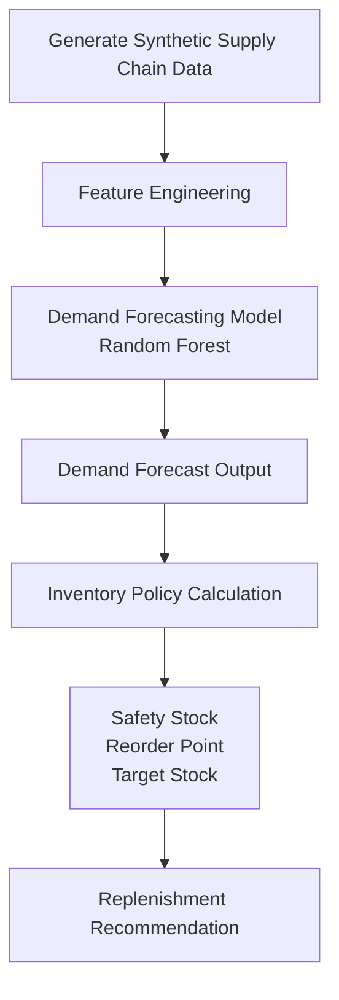
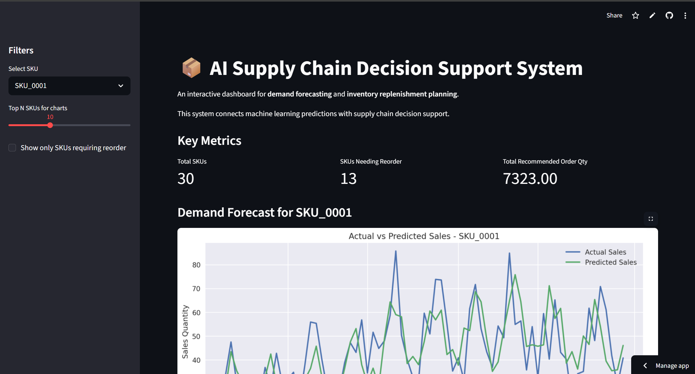
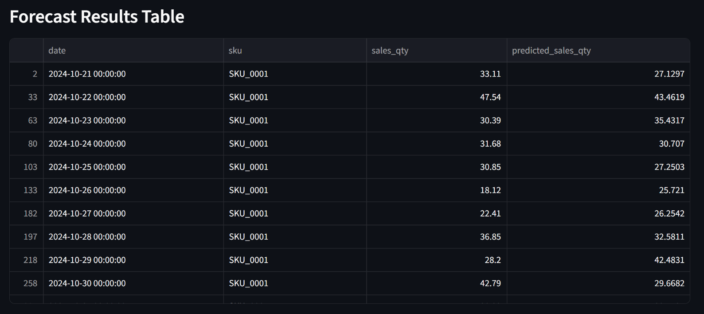

# AI-Driven Demand Forecasting & Inventory Replenishment Decision Support System

An end-to-end AI supply chain analytics project that forecasts product demand and generates inventory replenishment recommendations.

This project demonstrates how machine learning models can be integrated with operational decision logic to support supply chain planning. The system simulates a simplified enterprise workflow including demand forecasting, inventory policy calculation, and replenishment planning.

---

## Project Overview

Supply chain teams often need to answer two key questions:

1. **What will demand look like in the future?**  
2. **How much inventory should we replenish?**

This project builds a simplified **AI-driven decision support system** that connects demand prediction with inventory decision making.

The workflow of the system includes:

- Generating synthetic supply chain data  
- Training a demand forecasting model  
- Predicting future product demand  
- Calculating inventory policies (safety stock, reorder point)  
- Producing replenishment recommendations

The goal of this project is not only to predict demand but also to demonstrate how predictions can be converted into **actionable supply chain decisions**.

---

## Pipeline Diagram

## Dashboard Preview

The project includes an interactive **Streamlit dashboard** that visualizes forecasting results and inventory decisions.

The dashboard provides:

- Demand forecast visualization (Actual vs Predicted Sales)
- Inventory policy overview for each SKU
- Recommended replenishment quantities
- Key operational metrics
- Interactive SKU selection

### Dashboard Overview

### Demand Forecast Example

### Inventory Policy Visualization

---

## Key Results

The system produces several outputs that support supply chain decision making.

### Demand Forecast Output

The forecasting model predicts daily sales for each SKU.

Example output file:

