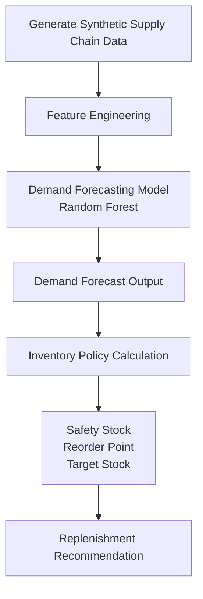

# AI-Driven Demand Forecasting & Inventory Replenishment DSS

This project was built as a personal learning project to explore how AI techniques can be applied to supply chain analytics.

The goal of this project is to build a simple system that predicts product demand and generates inventory replenishment suggestions.

Through this project I experimented with combining:

- machine learning demand forecasting  
- inventory policy calculation  
- interactive dashboard visualization  


The system simulates a simplified **enterprise analytics workflow**:

- Demand forecasting  
- Inventory policy calculation  
- Replenishment decision support  
- Interactive dashboard visualization  

---

# Live Demo

Interactive dashboard:

https://lae2lnyssajmtjfhsyy9il.streamlit.app/

---

# Project Overview

Supply chain teams constantly need to answer two key questions:

- **What will future demand look like?**  
- **How much inventory should we replenish?**

This project builds a simplified **AI-driven decision support system** that connects **demand forecasting with inventory planning**.

The pipeline includes:

- Synthetic supply chain data generation  
- Feature engineering  
- Demand forecasting using machine learning  
- Inventory policy calculation  
- Replenishment recommendation  
- Interactive dashboard visualization  

The goal is not only to **predict demand**, but also to demonstrate how predictions can be converted into **actionable operational decisions**.


---

## Pipeline Diagram



## Dashboard Preview

The project includes an interactive **Streamlit dashboard** that visualizes forecasting results and inventory decisions.

The dashboard provides:

- Demand forecast visualization (Actual vs Predicted Sales)
- Inventory policy overview for each SKU
- Recommended replenishment quantities
- Key operational metrics
- Interactive SKU selection

### Dashboard Overview


### Demand Forecast Example 


---

# Key Results

The system produces operational insights including:

## Demand Forecasting

Predict future demand for each SKU using a **Random Forest regression model**.

Evaluation metrics example:

```text
MAE  = 9.98
RMSE = 27.07
```

## Inventory Decision Support

For each SKU the system calculates:

- Safety stock
- Reorder point
- Target stock
- Recommended order quantity

## Operational Metrics

Example dashboard KPIs:

- Total SKUs: 30
- SKUs requiring reorder: 13
- Total recommended replenishment quantity: 7323

## Tech Stack

### Machine Learning

- scikit-learn
- pandas
- numpy

### Visualization

- matplotlib
- Streamlit

### Development

- Python
- Git
- GitHub

### Deployment

- Streamlit Cloud

---

## Future Improvements

Possible extensions for this project:

- multi-SKU forecasting models
- probabilistic demand forecasting
- service level optimization
- multi-warehouse inventory planning
- automated retraining pipelines

## License

This project is for educational and demonstration purposes.


