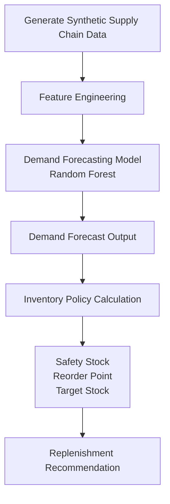
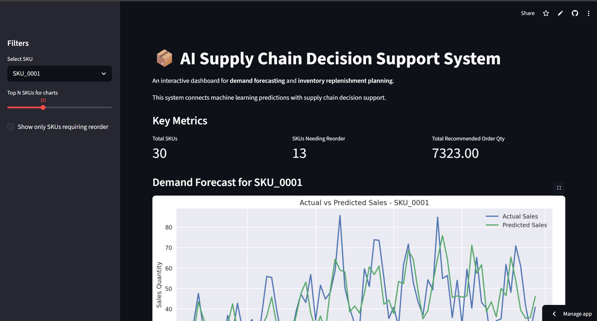
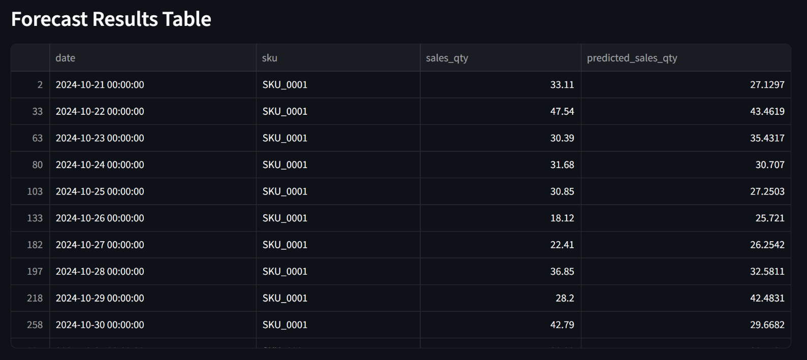

# AI-Driven Demand Forecasting & Inventory Replenishment DSS

This project was built as a personal learning project to explore how AI techniques can be applied to supply chain analytics.

The goal of this project is to build a simple system that predicts product demand and generates inventory replenishment suggestions.

Through this project I experimented with combining:

- machine learning demand forecasting  
- inventory policy calculation  
- interactive dashboard visualization  


The system simulates a simplified **enterprise analytics workflow**:

- Demand forecasting  
- Inventory policy calculation  
- Replenishment decision support  
- Interactive dashboard visualization  

---

# Live Demo

Interactive dashboard:

https://lae2lnyssajmtjfhsyy9il.streamlit.app/

---

# Project Overview

Supply chain teams constantly need to answer two key questions:

- **What will future demand look like?**  
- **How much inventory should we replenish?**

This project builds a simplified **AI-driven decision support system** that connects **demand forecasting with inventory planning**.

The pipeline includes:

- Synthetic supply chain data generation  
- Feature engineering  
- Demand forecasting using machine learning  
- Inventory policy calculation  
- Replenishment recommendation  
- Interactive dashboard visualization  
- A single AI agent with read-only supply-chain tools

The goal is not only to **predict demand**, but also to demonstrate how predictions can be converted into **actionable operational decisions**.

> **Data scope:** The checked-in forecast file contains historical test-period
> backtest predictions. The agent labels these results as backtests and does not
> present them as a live future forecast.


---

## Pipeline Diagram


```mermaid
flowchart TD

A[Generate Synthetic Supply Chain Data]

B[Feature Engineering]

C[Demand Forecasting Model<br>Random Forest]

D[Demand Forecast Output]

E[Inventory Policy Calculation]

F[Safety Stock<br>Reorder Point<br>Target Stock]

G[Replenishment Recommendation]

A --> B
B --> C
C --> D
D --> E
E --> F
F --> G


```

## Dashboard Preview

The project includes an interactive **Streamlit dashboard** that visualizes forecasting results and inventory decisions.

The dashboard provides:

- Demand forecast visualization (Actual vs Predicted Sales)
- Inventory policy overview for each SKU
- Recommended replenishment quantities
- Key operational metrics
- Interactive SKU selection

### Dashboard Overview


### Demand Forecast Example 


---

# Key Results

The system produces operational insights including:

## Demand Forecasting

Predict future demand for each SKU using a **Random Forest regression model**.

Evaluation metrics example:

```text
MAE  = 9.98
RMSE = 27.07
```

## Inventory Decision Support

For each SKU the system calculates:

- Safety stock
- Reorder point
- Target stock
- Recommended order quantity

## Operational Metrics

Example dashboard KPIs:

- Total SKUs: 30
- SKUs requiring reorder: 13
- Total recommended replenishment quantity: 7323

## Tech Stack

### Machine Learning

- scikit-learn
- pandas
- numpy

### Visualization

- matplotlib
- Streamlit

### AI Agent

- OpenAI Agents SDK
- OpenRouter-compatible model provider (Claude by default)
- Four deterministic, read-only function tools
- Natural-language forecast, inventory and replenishment explanations

### Development

- Python
- Git
- GitHub

### Deployment

- Streamlit Cloud

---

## AI Supply Chain Agent

The dashboard includes a minimal single agent based on the official OpenAI
Agents SDK tool-calling pattern. The language model selects tools and explains
their results, while deterministic Python functions perform all calculations.

Available tools:

- `get_demand_forecast_tool`
- `get_inventory_status_tool`
- `calculate_replenishment_tool`
- `run_replenishment_scenario_tool`

The first version is read-only. It cannot create, approve or submit purchase
orders, and it explicitly reports missing inputs such as open orders, MOQ,
case-pack and capacity constraints.

### Local setup

```powershell
python -m venv .venv
.venv\Scripts\Activate.ps1
pip install -r requirements.txt
Copy-Item .streamlit\secrets.toml.example .streamlit\secrets.toml
```

Edit `.streamlit/secrets.toml` and add your OpenRouter key:

```toml
OPENROUTER_API_KEY = "your-openrouter-api-key"
OPENROUTER_MODEL = "~anthropic/claude-sonnet-latest"
```

The OpenRouter provider takes precedence when both provider keys exist. The
OpenAI configuration remains available as an optional fallback:

```toml
OPENAI_API_KEY = "your-openai-api-key"
OPENAI_MODEL = "gpt-5.6-luna"
```

Then run:

```powershell
streamlit run dashboard.py
```

Example questions:

- `Why does SKU_0011 need replenishment?`
- `Summarize the latest 14 available forecast rows for SKU_0003.`
- `Recalculate SKU_0008 at a 97% service level.`
- `What happens to SKU_0011 if lead time increases to 14 days and demand rises 20%?`

Run deterministic tests without making any model calls:

```powershell
python -m unittest discover -s tests -v
```

---

## Future Improvements

Possible extensions for this project:

- multi-SKU forecasting models
- probabilistic demand forecasting
- service level optimization
- multi-warehouse inventory planning
- automated retraining pipelines

## License

This project is for educational and demonstration purposes.


