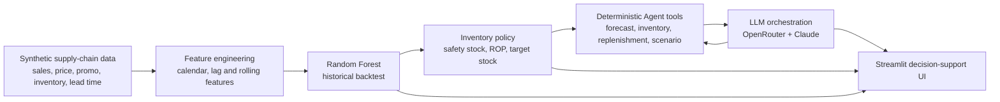

# AI Supply Chain Planning Agent

A Streamlit application for SKU-level demand analysis, inventory replenishment
planning and conversational what-if analysis. It combines a Random Forest
demand model, deterministic Python inventory calculations and a tool-calling AI
assistant in one decision-support workflow.

[Open the live analytics dashboard](https://lae2lnyssajmtjfhsyy9il.streamlit.app/)

> **Data note:** the application uses a reproducible synthetic dataset. Forecast
> values shown in the repository are historical test-period predictions rather
> than live future forecasts.

## Overview

The application supports five connected tasks:

1. generate a configurable supply-chain dataset covering 30 SKUs and 365 days;
2. build SKU-level demand features from price, promotion, calendar and demand
   history;
3. evaluate a Random Forest model on a held-out historical period;
4. calculate safety stock, reorder points, target stock and replenishment
   quantities with deterministic Python services; and
5. query forecasts, inventory status and replenishment scenarios through a
   read-only AI assistant or the Streamlit dashboard.

## Business problem

Supply-chain planners repeatedly need to connect three questions:

1. What demand pattern is visible at SKU level?
2. Which SKUs are below their reorder point, and how much should be ordered?
3. How would the recommendation change if demand, lead time or service level
   changed?

The workflow separates prediction, inventory calculations and natural-language
interaction. The machine-learning layer produces a historical test-period
backtest, Python services calculate inventory recommendations, and the Agent
selects the appropriate service before explaining its result. The language model
does not calculate order quantities itself.

## System architecture


```mermaid
flowchart LR
    A["Synthetic supply-chain data<br/>sales, price, promo, inventory, lead time"]
    B["Feature engineering<br/>calendar, lag and rolling features"]
    C["Random Forest<br/>historical backtest"]
    D["Inventory policy<br/>safety stock, ROP, target stock"]
    E["Deterministic Agent tools<br/>forecast, inventory, replenishment, scenario"]
    F["LLM orchestration<br/>OpenRouter + Claude"]
    G["Streamlit decision-support UI"]

    A --> B --> C --> D --> E
    F --> E
    E --> F --> G
    C --> G
    D --> G
```

## Agent design

The application uses a single Agent with four read-only tools:

| Tool | Business purpose |
| --- | --- |
| `get_demand_forecast_tool` | Summarize the latest available SKU backtest window and forecast error |
| `get_inventory_status_tool` | Retrieve inventory, lead time, reorder point and current replenishment status |
| `calculate_replenishment_tool` | Recalculate safety stock, reorder point and order quantity for a service level |
| `run_replenishment_scenario_tool` | Compare demand and lead-time what-if scenarios without modifying source data |

Example questions:

```text
Why does SKU_0011 need replenishment?
Summarize the latest 14 forecast rows for SKU_0003.
Recalculate SKU_0008 at a 97% service level.
What happens to SKU_0011 if lead time becomes 14 days and demand rises 20%?
```

The Agent follows three explicit boundaries:

- factual numbers must come from a deterministic tool;
- current forecast outputs must be labelled as historical backtest data;
- the Agent cannot create, approve or submit a purchase order.

## Current results

The checked-in outputs currently contain:

| Metric | Result |
| --- | ---: |
| SKUs | 30 |
| Backtest window | 2024-10-21 to 2024-12-30 |
| Forecast rows | 2,106 |
| MAE | 9.98 units/day |
| RMSE | 27.07 units/day |
| SKUs flagged for replenishment | 13 |
| Total recommended quantity | 7,323 units |

All figures come from generated project data. They describe the checked-in test
run and should not be interpreted as production KPIs or results from a real
company.

## Dashboard

The Streamlit application includes:

- SKU filters and actual-versus-predicted demand charts;
- current inventory, reorder point, target stock and recommended quantity;
- top-demand and top-replenishment visualizations;
- downloadable forecast and replenishment tables;
- an Agent chat entry when an API provider is configured.


## Repository structure

```text
.
├── configs/params.yaml                  # Reproducible simulation parameters
├── data/raw/                            # Synthetic sales and inventory inputs
├── outputs/forecasts/                   # Historical backtest predictions
├── outputs/replenishment/               # Replenishment policy snapshot
├── src/data/make_dataset.py             # Synthetic data generation
├── src/forecasting/                     # Features and Random Forest training
├── src/inventory/inventory_policy.py    # Inventory policy calculations
├── src/agent/                           # Agent, tools and deterministic services
├── tests/                               # Service and provider-selection tests
└── dashboard.py                         # Streamlit application
```

## Run locally

### 1. Install dependencies

```powershell
python -m venv .venv
.venv\Scripts\Activate.ps1
python -m pip install -r requirements.txt
```

### 2. Configure OpenRouter

Copy the safe example file:

```powershell
Copy-Item .streamlit\secrets.toml.example .streamlit\secrets.toml
```

CMD users can run:

```cmd
copy ".streamlit\secrets.toml.example" ".streamlit\secrets.toml"
```

Add the real key only to `.streamlit/secrets.toml`:

```toml
OPENROUTER_API_KEY = "your-openrouter-api-key"
OPENROUTER_MODEL = "~anthropic/claude-sonnet-latest"
```

The real `secrets.toml` is ignored by Git and must never be committed. OpenAI is
also supported as an optional fallback through `OPENAI_API_KEY` and
`OPENAI_MODEL`.

### 3. Start the application

```powershell
python -m streamlit run dashboard.py
```

Open `http://localhost:8501` and scroll to **AI Supply Chain Agent**.

## Rebuild the analytical outputs

```powershell
python src/data/make_dataset.py --config configs/params.yaml --outdir data/raw
python src/forecasting/train_model.py
python src/inventory/inventory_policy.py
```

## Tests

The deterministic services and provider selection can be tested without making
any paid model request:

```powershell
python -m unittest discover -s tests -v
```

Current test coverage checks:

- backtest labelling and valid SKU handling;
- inventory-policy output availability;
- non-negative replenishment quantities;
- scenario monotonicity when demand increases;
- OpenRouter selection and OpenAI fallback configuration.

## Scope and limitations

The current implementation is intentionally scoped to analysis and decision
support:

- Forecast results are historical test-period predictions, not a live recursive
  future forecast.
- Safety stock currently uses variability in point predictions rather than a
  calibrated forecast-error distribution.
- Open orders, backorders, allocations, MOQ, case-pack, supplier capacity and
  budget constraints are not yet available in the dataset.
- The Agent is intentionally read-only and keeps purchase-order approval outside
  the automated workflow.

Planned extensions include rolling-origin validation, forecast-error-based
safety stock, inventory-position logic, constraint validation, monitoring and an
approval-gated purchase-order draft workflow.

## Technology stack

- **Data and ML:** Python, Pandas, NumPy, scikit-learn
- **Decision logic:** deterministic Python inventory services
- **Agent:** OpenAI Agents SDK, OpenRouter-compatible provider, Claude
- **Application:** Streamlit, Matplotlib
- **Quality:** unittest, Git, GitHub
